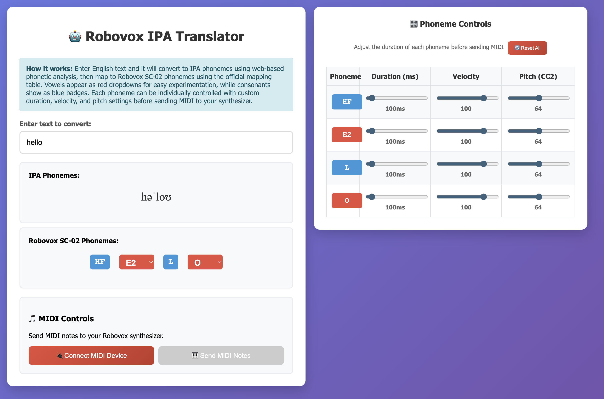

# Robovox IPA Translator

A browser-based tool that converts English text into IPA, maps IPA to Robovox SC-02 phonemes, and sends the sequence as MIDI notes to a connected synth.

## What It Does

- Converts typed text to an approximate IPA transcription.
- Maps IPA symbols to Robovox SC-02 phoneme tokens.
- Shows consonants as blue badges and vowels as red dropdowns (for quick vowel swapping).
- Builds per-phoneme controls for:
  - duration (ms)
  - velocity
  - pitch (MIDI CC2)
- Sends the phoneme sequence over Web MIDI, one note per phoneme.

## Project Structure

- `robovox_translator.html`: single-file app (UI, mapping tables, MIDI logic, controls).

## How To Run

1. Open `robovox_translator.html` in a modern browser with Web MIDI support (Chrome/Edge recommended).
2. Connect your MIDI output:
   - Click **Connect MIDI Device**
   - Select your output device in the dialog
   - Click **Connect**
3. Type text in the input field.
4. Optionally adjust phoneme duration/velocity/pitch controls.
5. Trigger playback:
   - Click **Send MIDI Notes**
   - Or use the keyboard shortcut documented below.

## Keyboard Controls

- `Space`: send/play the phoneme MIDI sequence.
  - Works when the text input is **not focused**.
  - If the text input is focused, Space inserts a normal space character.

## Notes On Mouse-Free Use

- Playback itself can be launched with `Space`.
- Initial MIDI connection currently uses a click-based device picker dialog, so full mouse-free setup is not fully implemented in the current UI.

## Implementation Notes

- The app includes two conversion stages:
  - `textToIPA(...)`: dictionary + simple fallback rules.
  - IPA to SC-02 mapping via `ipaToSC02`.
- During MIDI send:
  - CC2 pitch is sent first.
  - Then Note On.
  - Then Note Off after the phoneme duration.
- A `PA0` phoneme is inserted between words for separation.
